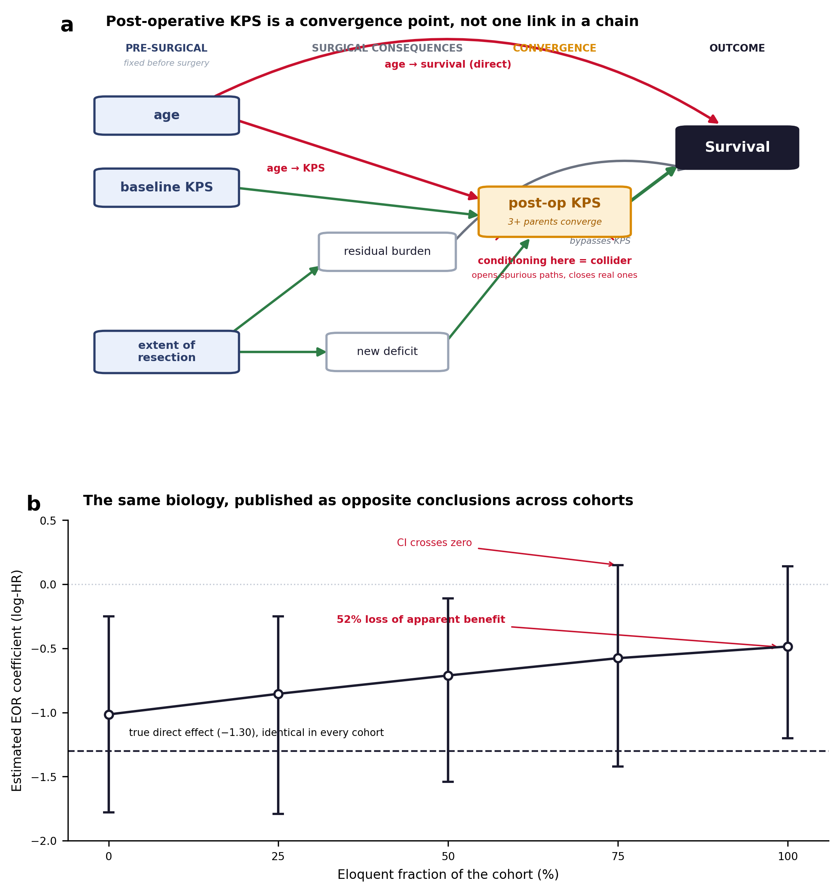

# eor-sim — the extent-of-resection "double-duty" problem

[](https://github.com/REPLACE_ME/gbm-eor-simulation/actions)
[](LICENSE)
[](https://www.python.org/)

A small, teachable simulation showing why a conventional survival model can
report **the same biology as opposite conclusions** depending on which tumors
happen to be in a cohort. It accompanies a manuscript on model structure in
glioblastoma prediction (see [Citation](#citation)).



---

## The one-paragraph version

Extent of resection (EOR) does two opposing things: it removes tumor (helps) and
it risks a new neurological deficit that lowers performance status (hurts). The
deficit path is steeper in eloquent tumors. Almost every published model
represents both effects with a **single coefficient**. This simulation fixes the
true biology in advance and shows that the fitted EOR coefficient still drifts —
by roughly half — as a cohort's eloquent fraction changes, with the confidence
interval crossing zero at the eloquent end. Two honest centers, same biology,
opposite published conclusions.

## What this is, and is not

**Is:** an illustration of a statistical mechanism, with the true answer known
because we specify it. A tool for reasoning, teaching, and a starting point for
analysis on real data.

**Is *not*:** a validated prognostic model. Do not use any number it produces to
make a decision about a real patient. The simulation also treats post-operative
KPS as a *single mediator*; in reality it is a **convergence point** (baseline
KPS, age, and the new deficit all act on it), which means an honest analysis of
real data is a causal-mediation problem requiring g-methods, not a regression
with more terms. Conditioning on that convergence point can introduce collider
bias — see the manuscript's Limitations.

---

## Install

```bash
pip install -e ".[notebook]"     # from a clone, with notebook + plotting extras
# or the minimum:
pip install -e .
```

Requires Python 3.9+. Core dependencies: numpy, pandas, lifelines.

## Three ways to use it

The repo is layered for three audiences.

### 1. Reproduce the paper figure (reviewers / readers)

```bash
python scripts/reproduce_figure.py     # prints the tables, writes eor_reproduced.png
```

or, without cloning the scripts:

```bash
eor-sim figure --out figure.png
eor-sim sweep                          # the table, in the terminal
```

Expected: the EOR coefficient moves from about −1.0 (no eloquent tumors) to
about −0.5 (all eloquent) while the true effect stays fixed at −1.30.

### 2. Explore it interactively (teaching)

```bash
jupyter notebook notebooks/explore.ipynb
```

Sliders let you turn the mechanism up and down. Setting the interaction term
`d_eor_x_eloq` to **0** should flatten the drift — the built-in falsification
check. (Open directly in Colab by uploading the notebook; the first cell
installs dependencies.)

### 3. Run the same estimators on your own cohort (researchers)

```bash
python examples/run_on_your_data.py your_cohort.csv
```

Your CSV needs columns: `eor, eloquent, kps_pre, kps_post, time, event`. The
script fits both the total-effect model (adjusts for **pre-op** KPS — the
quantity a surgical decision needs) and the mediator-adjusted model (conditions
on **post-op** KPS — cleaner-looking, wrong for that decision), and reports the
gap between them. **Read the header of that file before trusting the output.**

To try it immediately on synthetic data:

```bash
python examples/make_sample_data.py
python examples/run_on_your_data.py examples/sample_cohort.csv
```

---

## The falsification check

The paper insists on one discipline before believing any result: remove the
mechanism and confirm the effect disappears.

```bash
eor-sim falsify
```

This sets the eloquent-specific interaction to zero and checks that the slope
collapses. If it did not, the estimator would be detecting something never put
in, and nothing downstream could be trusted.

## Library use

```python
from eor_sim import simulate_cohort, fit_total_effect, sweep_eloquent_fraction

df = simulate_cohort(n=1500, p_eloquent=0.5, rng=0)
coef, lo, hi = fit_total_effect(df)          # (log-HR, 95% CI)

sweep = sweep_eloquent_fraction()            # the full grid as a DataFrame
```

All generative parameters live in `SimParams` (a frozen dataclass) and are
documented as assumptions, not estimates.

## Tests

```bash
pip install -e ".[dev]"
pytest -q
```

The suite includes the falsification check as a test: with the mechanism
removed, the slope must vanish.

---

## Publishing this repository

This code was scaffolded locally. To make the GitHub link live:

```bash
# 1. create an empty repo named gbm-eor-simulation on github.com (no README)
# 2. from this folder:
git init
git add .
git commit -m "Initial release: eor-sim v1.0.0"
git branch -M main
git remote add origin https://github.com/YOUR_USERNAME/gbm-eor-simulation.git
git push -u origin main
```

Then search-and-replace `REPLACE_ME` (URLs, badges) and the `REPLACE` fields in
`LICENSE`, `pyproject.toml`, and `CITATION.cff` with your details.

## Citation

If you use this software, please cite both the software (`CITATION.cff`) and the
accompanying paper. Fill in the manuscript details in `CITATION.cff` once the
reference is final.

## License

MIT — see [LICENSE](LICENSE).
